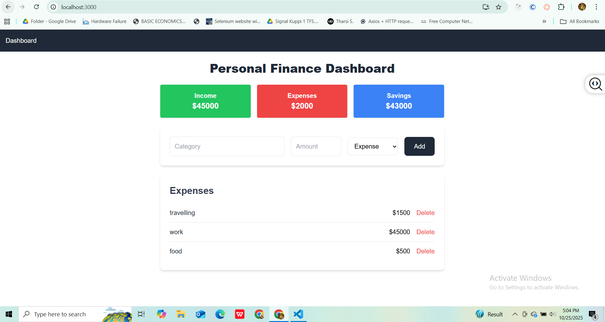

# Expense Tracker (MERN Stack)

A **full-stack personal finance dashboard** built with **React, Express, MongoDB, and Tailwind CSS**. Designed to track **income, expenses, and savings**, with a responsive and professional UI.

---

## Features

- Add **Income** and **Expense** transactions
- View **total Income, total Expenses, and Savings**
- Delete transactions
- Responsive and clean **Tailwind UI**
- Full backend with **MongoDB** and **Express**
- CORS configured to work with React frontend

---

## Tech Stack

**Frontend:**

- React.js (Functional Components & Hooks)
- Axios (HTTP client)
- Tailwind CSS (UI styling)

**Backend:**

- Node.js & Express.js
- MongoDB & Mongoose
- dotenv (Environment variables)
- CORS enabled

---

## Folder Structure
```
backend/
├─ models/
│ └─ Expense.js
├─ routes/
│ └─ expenseRoutes.js
├─ .env
└─ server.js

frontend/
├─ src/
│ ├─ components/
│ │ ├─ ExpenseForm.jsx
│ │ └─ ExpenseList.jsx
│ ├─ pages/
│ │ └─ ExpensesPage.jsx
│ └─ App.js
└─ package.json

```
---

## Setup & Installation

### Backend

1. Navigate to the `backend` folder:

```bash
cd backend
```
2. Install dependencies:

```bash
npm install
```

3. Create a .env file:

```bash
MONGO_URI=<Your MongoDB URI>
PORT=4000
```

4. Start the backend server:

```bash
node server.js
```

### frontend

1. Navigate to the `finance-dashboard` folder:

```bash
cd finance-dashboard
```
2. Install dependencies:

```bash
npm install
```

4. Start the frontend:

```bash
npm start
```
```bash
App runs at http://localhost:3000
```


## Tech Stack
1. Open http://localhost:3000 in the browser.

2. Add transactions via the form (select type: Income/Expense).

3. View totals in Income / Expense / Savings cards.

4. Delete any transaction from the list.


## Screenshot




## Notes

- Make sure MongoDB is running locally or provide a valid Atlas URI.

- Backend CORS is configured to allow requests from React frontend (http://localhost:3000).

- Tailwind CSS provides responsive and modern styling.

## Future Improvements

- User authentication (login/signup)
- Monthly or category-based expense reports
- Export data to CSV/PDF
- Add charts for income and expense visualization
- **AI-powered suggestions:** Integrate AI to provide personalized recommendations for budgeting, saving, and expense management based on user patterns.
